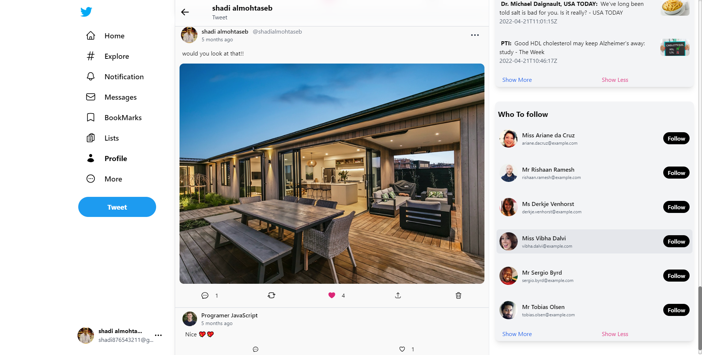
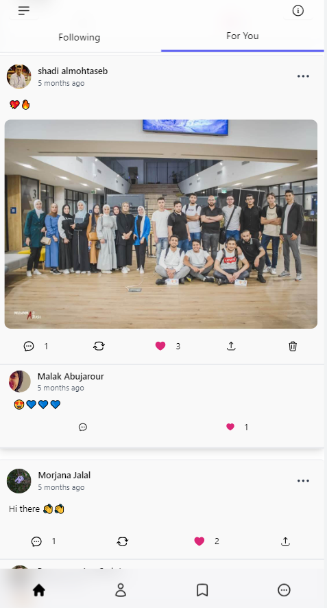

# Twitter Clone App

Fully Functional Twitter Clone app using react.js and next.js you can like a tweet or a comment and you can comment on any tweet and see who likes it and you can save tweets for later and manage your profile page and a lot of stuff.

## Learning Objectives

 - Firebase Auth
 - Firebase storage
 - Context API
 - CRUD operation
 - Tailwind CSS
 - Ant Design
 - Animation (Framer Motion)
 - State Management (recoil)
 - Timing and dates (React Moment)

## Demo

[URL See The Demo From Here!
](https://twitter-clone-shadi-almohtaseb.vercel.app/)

## App Preview

